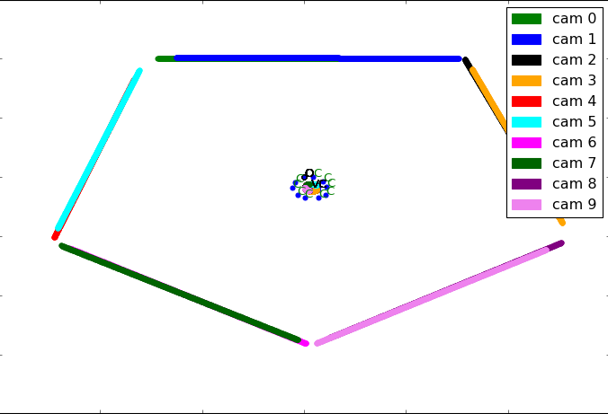
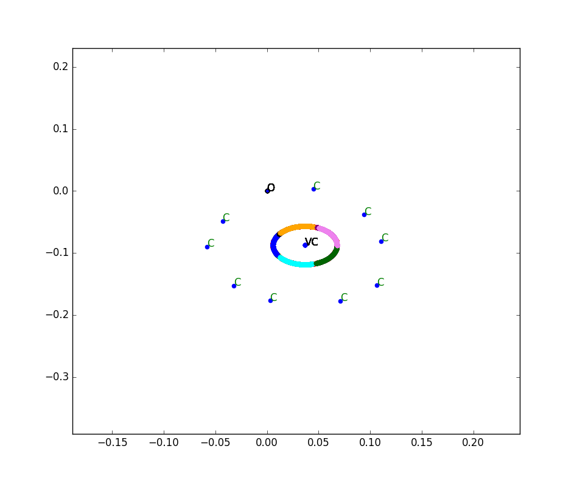

# ODS-for-VR
This repository is an implementation of the omni directional stereo renderer used in 'Jump'; google's framework for 360 degree Virtual reality.

# Camera rig description
The camera rig in our dataset consists of 10 cameras setup as shown below.

Though for ideal ODS rendering, we would like our cameras to be oriented radially outwards from the viewing circle, our rig 
consists of pairs of stereoscopic cameras. The images captured by the rig, as visualized on the 'xz' plane are as shown below. 

We see that the rig is primarily composed of 5 stereo pairs. The overlap between adjacent stereo pairs is very minimal. Therefore, 
though we have 10 cameras, we predominantly see only 5 image planes resembling a pentagon. 

On mapping these images onto the viewing circle for the left eye, we get the figure below. 

## 360 rendering without view interpolation

## 360 rendering with column wise flow for view interpolation

## 360 rendering with pixel wise flow for view interpolation

## Challenges with view interpolation
Given the small baseline between two images within a stereo pair, view interpolation with optical flow is easy. 
However due to the large baseline between adjacent stereo pairs, synthesizing images between adjacent stereo pairs with optical flow is
challenging. This is because when computing the optical flow between two such images, it is almost such that these two images are
two completely different scenes. Hence using optical flow for dense correspondences fails.

# Source file descriptions
## Core 
- SJPImage.py : OpenCV image wrapper with additional functionality
- cameras.py : Implements the camera class and all related functionality
- stitcher.py : Implements homography based image stitching
- renderer.py : The JUMP ODS renderer class
- viewSynth.py : OpenCV optical flow wrapper and composting code (To be implemented fully)
- ExposureCorrect.py : Jump exposure correction optimizer
- RayGeometry.py : Implements generic geometry functions

## Applications
- testapp_JumpRendererMain.py : Primary test app
- testapp_homographystitch.py : Simple homography based image stitching
- testapp_exposurecorrect.py : Unit tests for exposure correction
- testapp_denseflowStereo.py : Dense optical flow estimation for spatially separated cameras with opencv
- testapp_denseflow.py : Dense optical flow estimation for an image sequence captured from a single camera
- testapp_opencvOpticalflow.py : Unit tests for optical flow
- testapp_stereomatch.py : Unit tests for triangulation with stereo matching

# Directory structure
- To do

